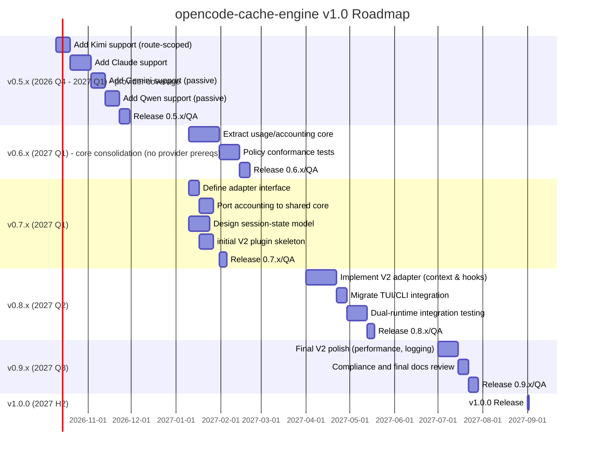

# Implementation Plan for **opencode-cache-engine** (v0.5.x → v1.0)

The **opencode-cache-engine** has completed its v0.4.x maintenance (fixing K1/K2 issues) and is ready to expand to additional providers and support both OpenCode V1 and V2 runtimes in a combined 1.x release line. This document outlines a step-by-step, role-based implementation plan covering:

- **Goals & Scope:** Scope of V1 stability, new provider features, V2 adapter development, and dual-runtime 1.0 release.
- **Branch Strategy:** Exact Git branch names and workflow for parallel V1 and V2 development.
- **Task List:** Detailed tasks with priorities, roles (maintainer, adapter-dev, policy-dev, QA), effort estimates, dependencies, and acceptance criteria.
- **File-Level Refactor Plan:** Which files to create/move/modify, with code snippets for the shared core and runtime adapter interfaces.
- **API Contracts:** Runtime adapter interface methods/types and an example policy registry schema (in JSON/YAML).
- **Testing Matrix:** Unit, integration, and live-model tests (with cost limits), test data and mocks.
- **CI & Packaging Checklist:** Steps for continuous integration and final packaging.
- **V2 Migration Checklist:** Mapping V1 hooks to V2 (`ctx.session.hook("context")`, `model.request`, compaction hooks, header handling).
- **Provider Recipes:** Superseded by §2, which defines the v0.5.x provider-coverage phase (Kimi, Claude, Gemini, Qwen) with per-provider tasks, tests, and acceptance criteria. Mistral and xAI/Grok are deferred candidates, not v0.5.x prerequisites.
- **Observability/Telemetry:** New telemetry fields to add (e.g. cache strategy, identity).
- **Risk Register & Rollback Plan:** Key risks and mitigation strategies.
- **Timeline & Milestones:** Gantt chart (mermaid) and acceptance criteria for 0.5.x–1.0.0 milestones.
- **Harness Commands:** Exact commands (Git, npm, OpenCode) to validate each milestone.

The plan assumes the `v0.4.13` baseline on `master` (v0.4.x maintenance complete; all known bugs fixed) and a repository at `https://github.com/AlexJoaquimPereira/opencode-cache-engine`.



**Acceptance Criteria (Milestones):** Each milestone (0.5.x–1.0.0) has specific done conditions. **0.5.x** is a provider-coverage phase: Kimi, Claude, Gemini, and Qwen each land as a separate validated release (see §2 for per-milestone exit conditions and the definition of done). **0.6.x** consolidates the shared core (usage/accounting extraction) and conformance tests with no provider prerequisites. **0.7.x** completes core/interface refactor (V2-stubs built, shared core usable by both). **0.8.x** sees a functioning V2 adapter (loading and mapping hooks, passing tests). **0.9.x** is a final stable dual-runtime beta. **1.0.0** is release-ready with complete documentation.

## 1. Goals and Scope

- **V1 Maintenance:** Keep `v0.4.x` stable. All v0.4 bug fixes (K1/K2) are done; no regressions allowed. (Existing metrics, accounting, and policy behavior remain unchanged unless explicitly enhanced.)
- **New Provider Strategies:** v0.5.x adds and validates cache strategies for four model families — **Kimi, Anthropic/Claude, Google Gemini, Qwen** — as independent, separately released increments (see §2). Mistral and xAI/Grok are deferred candidates, not prerequisites for this release line. Each provider strategy is independently researched and tested; provider additions are never bundled with a large architecture refactor.
- **V2 Adapter Development:** Build a parallel OpenCode V2 plugin adapter in its own branch, reusing the shared policy/core logic. This allows supporting both V1 and V2 concurrently by v1.0.
- **Dual-Runtime 1.0 Target:** Release 1.0.0 when the plugin works correctly under both OpenCode V1 and V2. The codebase should have a single shared core + two runtime adapters (V1 and V2 entry points) by then.

_Per Scope Constraints:_ Do **not** attempt to rebuild the plugin as a V2-only project or drop V1 support. Focus on cache logic; **pricing/cost thresholds are out of scope** (as per policy). All changes should preserve existing behavior unless refactoring for architecture.

## 2. v0.5.x — Provider coverage phase (Kimi, Claude, Gemini, Qwen)

`master` is on the v0.4.13 baseline and `feature/v2-adapter` is branched off that
tag. **v0.5.x is a provider-coverage phase, not an architecture phase.** The V2
adapter continues independently on its own branch. Prioritize the four families
below; Mistral and xAI/Grok are **not** prerequisites for this release line, and
provider additions are not combined with a large architecture refactor.

Every provider below still goes through the **audit-first** procedure in
`AGENTS.md`. The official links in this section are *starting references to
verify*, not verified evidence: confirm each field name, mechanism, TTL, and
usage mapping from first-party documentation and record it in
`docs/cache-policy-inventory.md` / `docs/research-findings.md` before writing
policy code. If evidence is insufficient, ship a passive/neutral policy.

### 2.1 Order and planning ranges

Estimates are working days for a solo developer and exclude waiting for provider
access or resolving undocumented behavior. Treat them as planning ranges, not
release commitments.

| # | Family           | Approach                                                                     | Estimate                  |
|---|------------------|------------------------------------------------------------------------------|---------------------------|
| 1 | Kimi             | Route-specific policy (Chat Completions / Responses vs Anthropic-compatible)  | 2–4 days after research  |
| 2 | Anthropic/Claude | Cache-marker policy validated against the real V1 request shape              | 3–5 days                  |
| 3 | Gemini           | Passive first: identify family, preserve requests, confirm usage exposure    | 2–4 days                  |
| 4 | Qwen             | Passive first; mutation only if first-party docs + V1 path prove benefit      | 2–4 days                  |

Kimi goes first because the official Moonshot documentation describes cache
behavior for several distinct request shapes, so route identification is the
highest-value early task. Ship fewer providers rather than lowering the evidence
or test standard: a validated passive policy is preferable to an active mutation
based on assumptions.

### 2.2 Phase structure — release incrementally

Each provider has its own tests and acceptance criteria and can ship as soon as
it is validated; the four-provider set does not need to land in one release.

| Milestone         | Scope                   | Exit condition                                              |
|-------------------|-------------------------|-------------------------------------------------------------|
| `0.5.0`           | Kimi                    | API-path-specific policy, tests, usage validation, docs     |
| `0.5.1`           | Kimi maintenance        | Audit fixes and hardening (ratio guard, coverage)           |
| `0.5.2`           | Anthropic / Claude      | Passive policy validated against the V1 request shape (OpenCode owns the `cache_control` breakpoints) |
| `0.5.3`           | Gemini                  | Passive policy and usage-reporting behavior validated       |
| `0.5.4`           | Qwen                    | Passive policy and any justified request controls validated |
| `0.5.x` follow-up | Fixes and consolidation | Regressions fixed; docs and package contents verified       |

These are suggested version slots, not mandatory version numbers. If a provider
needs more investigation, skip it temporarily and continue with another.

### 2.3 Step 0 — Establish the working baseline

Do this on `master` before changing provider behavior.

```bash
git status --short --branch
git log -5 --oneline --decorate
git describe --tags --exact-match
npm test
npm pack --dry-run
```

Verify:

- You are on `master`, starting from the intended v0.4.13 baseline.
- The working tree is clean, or any existing changes are understood.
- All existing tests pass.
- The package tarball includes the intended runtime and documentation files.
- The current policy registry and V1 hooks are understood before editing.

Stop condition: if tests fail on the untouched baseline, establish whether that
is a pre-existing environment issue or a regression before adding features. Do
not mix baseline repair with a provider feature. Do not cherry-pick V2 adapter
changes into `master` just to start provider work; V1 provider work proceeds on
the current V1 architecture.

### 2.4 Step 1 — Kimi (0.5.0–0.5.1)

Official reference to verify: Moonshot AI, *Best practices for context caching*
(`https://www.kimi.ai/academy/best-practices-for-context-caching`).

The documentation describes cache behavior for both the Chat Completions and
Responses APIs, including `prompt_cache_options`, and separately an
Anthropic-compatible Messages path with top-level `cache_control`. These are
different request shapes and must not be collapsed into one universal Kimi
policy.

Implementation tasks:

1. **Identify the supported request path.** Inspect how OpenCode identifies
   provider and model; determine whether the target configuration uses
   Moonshot's native API, an OpenAI-compatible endpoint, an
   Anthropic-compatible endpoint, or a gateway such as OpenRouter. Record which
   request hooks and body shapes are available in the existing V1 plugin.
2. **Write a short evidence note before coding.** Exact provider id and model
   identifiers to match; API endpoint/request format; whether caching is implicit
   or needs an explicit control; supported cache options and TTL values; cache
   read/write usage fields; whether behavior differs by endpoint or model.
3. **Implement the smallest valid policy.** For a verified Chat Completions or
   Responses path, determine whether the documented `prompt_cache_options` is
   useful (the current Moonshot documentation describes implicit mode and `5m`
   or `1h` TTL options). Do **not** add Anthropic-style `cache_control` to the
   OpenAI-compatible request path. Do not apply Kimi-specific options to
   unrelated OpenAI-compatible providers. Preserve existing request options and
   headers.
4. **Validate usage accounting.** Confirm how OpenCode exposes Kimi cache-read
   tokens and whether the existing usage normalization already handles the
   response. If OpenCode normalizes usage into the existing token schema, do not
   add a second provider-specific parser.
5. **Test and document.** Correct provider/model match; no mutation for unknown
   Kimi models or unrelated providers; expected mutation for the verified path;
   existing usage accounting stays correct; document endpoint/model coverage,
   limitations, and evidence.

Acceptance criterion: Kimi-specific behavior is gated to the verified request
path, tests pass, and the implementation does not assume every Kimi endpoint uses
the same caching mechanism.

### 2.5 Step 2 — Anthropic / Claude (0.5.2)

Official reference to verify: Anthropic, *Prompt caching*
(`https://platform.claude.com/docs/en/build-with-claude/prompt-caching`).

Anthropic supports automatic caching via a top-level `cache_control` field and
explicit breakpoints on individual content blocks; the documented usage response
distinguishes cache reads from cache creation.

Implementation tasks:

1. **Inspect the V1 request pipeline** and establish whether Claude requests go
   through Anthropic's native Messages API, an OpenAI-compatible transformation
   layer, or a gateway such as OpenRouter.
2. **Confirm where the V1 hook can safely mutate the request.** Do not assume the
   same request shape is available across routes.
3. **Begin with the smallest safe strategy.** If the native request supports
   automatic caching and the hook can safely add its top-level field, evaluate
   that first. Otherwise investigate whether explicit content-block markers can be
   added without changing message semantics. Do not attach `cache_control` to
   arbitrary message objects or assume a compaction summary is a valid marker
   location.
4. **Verify breakpoint support and prefix stability.** Marker placement decides
   what content is cached; it is not a generic flag.
5. **Confirm usage exposure.** Check cache-read and cache-creation usage via
   OpenCode's normalized representation; do not change the shared accounting
   schema without a demonstrated normalization gap.

Required tests: native Anthropic requests receive only supported mutations;
non-Anthropic requests unchanged; unknown Claude request shapes left unchanged;
system prompts, messages, tools, and content blocks preserved apart from the
intended marker; cache read/write not double-counted; existing policies and V1
regressions stay green.

Acceptance criterion: the policy uses a verified Claude request path and a
documented cache-control mechanism. If the V1 hook cannot safely express the
required shape, document the limitation and defer the mutation rather than
introducing a brittle workaround.

### 2.6 Step 3 — Gemini (0.5.3)

Official reference to verify: Google AI, *Context caching*
(`https://ai.google.dev/gemini-api/docs/caching`).

Google documents implicit caching with model-specific minimum input sizes, and
cache-hit usage exposed through `usage.total_cached_tokens` in the documented
API response. Explicit cache-object management is a separate mechanism.

Implementation tasks:

1. Determine which Gemini API route OpenCode uses and how its response usage is
   normalized.
2. Add a passive policy for verified Gemini model identifiers.
3. Do not add cache keys, markers, or explicit cache objects unless the actual
   endpoint documents and requires them.
4. Verify the existing usage collector sees cache-hit data through OpenCode's
   normalized message representation.
5. If cache-hit data is missing, investigate the normalization boundary first; do
   not build a Gemini-specific parser until you establish OpenCode does not
   already normalize it.
6. Document that passive caching does not guarantee a hit; model eligibility,
   prefix stability, and minimum input requirements still apply.

Required tests: policy resolves for supported model identifiers; the passive
policy does not mutate the request; unrelated Google models and other providers
are unaffected unless explicitly covered; usage counted correctly when
cached-token data is present; missing cache-usage fields handled safely.

Acceptance criterion: Gemini is recognized and its cache usage accounted for
wherever existing OpenCode data makes that possible. No explicit cache-object
lifecycle management in this task.

### 2.7 Step 4 — Qwen (0.5.4)

Official reference to verify: Qwen Cloud, *FAQ — text generation*
(`https://docs.qwencloud.com/resources/faq-text-generation`).

Qwen's documentation describes implicit caching, explicit `cache_control`
markers, and a session-caching option for the Responses API, with differing
minimum token requirements and usage reporting. These strategies must not be
collapsed into one generic Qwen behavior.

Implementation tasks:

1. **Establish the actual Qwen route:** which provider id does OpenCode expose;
   is the endpoint Qwen Cloud, DashScope, OpenRouter, or another gateway; is the
   request Chat Completions, Responses, or something else.
2. Start with passive behavior if the endpoint supports implicit caching and
   requires no request mutation.
3. Add explicit markers or session-caching controls **only** if the official
   documentation covers the exact endpoint, the current V1 hook can express the
   required shape, there is clear benefit over passive behavior, and tests prove
   the mutation is correctly gated.
4. Verify cache-read usage fields through OpenCode's normalized response.
5. Document endpoint-specific differences; do not apply Qwen Cloud controls to
   every model whose name contains `qwen`.

Acceptance criterion: Qwen behavior is scoped to verified models and endpoints,
with no speculative cache-control mutations.

### 2.8 Shared test requirements for every provider

Add provider-specific tests in the existing test layout; there is no need to
reorganize the suite for this phase.

| Test                                       | Expected result                                       |
|--------------------------------------------|-------------------------------------------------------|
| Matching provider and model                | Correct policy resolves                               |
| Unknown model in the same family           | Neutral behavior unless explicitly covered            |
| Different provider with similar model name | No provider-specific mutation                         |
| Existing request options                   | Preserved                                             |
| Existing headers with different casing     | Not duplicated or overwritten unintentionally         |
| Passive caching                            | No unnecessary cache-control mutation                 |
| Usage fields absent                        | Safe handling, no invented cache hits                 |
| Cached-token usage present                 | Counted once through the existing normalization path  |
| Repeated idle / cursor missing             | Existing accounting guarantees preserved              |
| Existing policy regression suite           | All tests continue to pass                            |

For Anthropic and Kimi in particular, add tests for API-route differences: a
provider name alone is not evidence that all endpoints share one request schema.

### 2.9 Architecture: what to change now, and what to defer

Keep architecture work separate from provider additions.

**Do now, only when needed:** narrowly scoped policy entries and tests using the
existing registry and resolver. Add a small field only if a concrete provider
requires it.

**Keep on `feature/v2-adapter`:** V2 plugin loading, V2 hook mapping, and
runtime-specific integration. Provider policies continue to be developed and
tested on `master`.

**Defer:** a generic provider framework, large file moves, a full adapter
abstraction, and explicit cache-object lifecycle management. Do these only when
repeated real requirements justify them.

One architecture task stays in view: before the V2 adapter ports usage
accounting, identify which accounting functions can be extracted as pure,
runtime-neutral logic. Do it as a separately scoped task with tests that
preserve the existing cursor and watermark behavior. It should not block the four
provider tasks.

### 2.10 Branch and release workflow

Use a separate short-lived branch per provider if that fits your workflow:

```bash
git switch master
git pull --ff-only
git switch -c feature/provider-kimi
```

After implementation:

```bash
npm test
npm pack --dry-run
git diff --check
git status --short
git diff
```

Review the diff for unintended request mutations and unrelated refactors, and
merge only after the acceptance criteria pass. Repeat independently for Claude,
Gemini, and Qwen.

Keep `feature/v2-adapter` isolated. When a provider change introduces a genuinely
shared-core improvement that V2 will need, merge or cherry-pick that specific
reviewed change into the V2 branch and run its tests there; avoid routinely
merging half-finished provider branches into V2.

Before publishing each version, update the changelog and version as appropriate,
rerun the full suite, inspect the package contents, and verify documented
behavior matches the implementation.

### 2.11 Suggested schedule

Working days for a solo developer; research and implementation may overlap where
practical.

| Week | Work                                                                                    |
|------|-----------------------------------------------------------------------------------------|
| 1    | Baseline verification; Kimi route research, implementation, and tests                   |
| 2    | Finish Kimi validation and release; implement Claude                                     |
| 3    | Finish Claude; implement Gemini passive policy and usage checks                          |
| 4    | Implement Qwen passive policy; investigate any justified endpoint-specific controls      |
| 5    | Regression pass, documentation consolidation, packaging, release remaining validated work |

If time is limited, ship fewer providers rather than lowering the evidence or
test standard.

### 2.12 Definition of done for v0.5.x

- Kimi, Claude, Gemini, and Qwen each have separate evidence notes and scoped
  policies.
- Each policy matches only the intended provider, model family, and API route.
- Every request mutation is supported by first-party documentation and tested.
- Cache read/write usage uses OpenCode's normalized data wherever available.
- Existing accounting behavior and regression tests remain intact.
- No pricing-boundary or context-limit enforcement has been added.
- No V2 runtime code has leaked into `master`.
- README or provider-policy documentation explains implemented coverage and
  limitations.
- `npm test`, `npm pack --dry-run`, and `git diff --check` pass.
- Each release contains only validated changes.

Recommended immediate task: start with Kimi route research, then implement the
smallest verified Kimi policy on `master`. Keep Claude, Gemini, and Qwen as
separate follow-on tasks, not a single multi-provider patch.

## 3. Branch Strategy

Use Git branches for parallel development:

- **`main` (alias `master`):** The primary development branch. Contains V1-compatible shared core and policies. Releases (e.g., 0.5.x, 0.6.x, etc.) are merged/tagged here.
- **`feature/v2-adapter`:** Development of the OpenCode V2 adapter. Branch off from `main` at the current v0.4. baseline. Merge changes *from* `main` into `feature/v2-adapter` as needed; do not merge `v2-adapter` *into* `main` until feature complete.
- **`feature/provider-<name>` (optional):** For each major provider (e.g. `feature/provider-kimi`), implement the new cache policy and tests. Once done, merge into `main`.
- **`release/x.y.z` or `main` tags:** Tag release versions after QA.

No V2-related code goes into `main` until the integration phase. V1 maintenance and new provider work proceed on `main`; V2 adapter evolves on its own branch.

## 4. Detailed Task List

Each task below includes priority, assigned role(s), effort, and dependencies.  Effort is rough (days) per developer.

| Task (Milestone)                                     | Priority | Owner(s)           | Effort | Dependencies                          | Acceptance Criteria                         |
|------------------------------------------------------|---------|--------------------|-------:|---------------------------------------|---------------------------------------------|
| **Provider Strategies (0.5.x & 0.6.x)**              |         |                    |        |                                       |                                             |
| - Integrate **Kimi** (route-scoped: `prompt_cache_options` on Chat/Responses vs `cache_control` on the Anthropic-compatible path) | High | policy-dev | 2–4d after research | none (first task in §2) | Route identified and recorded; policy gated to the verified request path; no `cache_control` on the OpenAI-compatible path; usage accounted; tests pass. |
| - Integrate **Anthropic (Claude)** (top-level `cache_control` / explicit breakpoints) | High | policy-dev | 3–5d | none | Policy uses a verified Claude request path and a documented cache-control mechanism; non-Anthropic requests untouched; read/write usage not double-counted. |
| - Integrate **Google Gemini** (passive/implicit) | Medium | policy-dev | 2–4d | none | Gemini models recognized; no request mutation; cache-hit usage accounted through existing normalization. Tests pass. |
| - Integrate **Qwen** (passive first; markers only if justified) | Medium | policy-dev | 2–4d | none | Qwen behavior scoped to verified models/endpoints; no speculative cache-control mutations. Tests pass. |
| - **Deferred candidates** (not v0.5.x prerequisites): Mistral, xAI/Grok | Low | policy-dev | 2–3d each | optional | Tracked for a later phase; each still requires its own audit-first evidence note. |
| - **Policy Registry Update:** encode new families, strategies | High    | maintainer/policy-dev | 2d    | above provider tasks complete         | Shared `cache-policy-core` updated with new entries. No compile/test failures. |
| - **Policy Conformance Tests:** Add generic tests (unknown models, no double-count, etc.) | High    | QA                 | 2d    | above policies                        | All provider strategies pass new and existing tests. |
| **Core Refactoring (0.6.x, not 0.5.x)**              |         |                    |        |                                       |                                             |
| - **Cache Identity Abstraction:** Extract identity logic  | Medium  | adapter-dev/maintainer | 1d | policy registry extended             | A helper resolves a unique ID (e.g. string) per session. Code reuse across providers. |
| - **Extract Usage Accounting:** Create `usage-core` module (migrate scanPage, nextCursor) | High | adapter-dev        | 2d    | none                                  | Usage logic is in a pure module (e.g. `cache-usage-core.mjs`). V1 adapter calls it. Tests added pass. |
| - **Define Adapter Interface:** draft TypeScript interface for runtime adapter (hooks, context, messages, etc.) | High  | adapter-dev       | 1d    | none                                  | An interface (or abstract class) like `OpenCodeRuntime` defined; V1 and V2 adapters use it. |
| - **Session State Model:** Define `SessionState` shape, store (Map or storage) | Medium  | adapter-dev        | 2d    | none                                  | Session state fields (lastID, lastAt, etc.) formalized. Memory usage bound checks. |
| **Testing & QA**                                     |         |                    |        |                                       |                                             |
| - **Unit Tests:** Write/extend tests for new policies and refactors | High    | QA                 | 3d    | above tasks                          | `npm test` shows 100% pass, no regressions. Coverage report. |
| - **Integration Tests:** CI pipeline tests for both V1 and V2 (once V2 implemented) | Medium | QA                 | 2d    | V2 adapter base ready                | CI script runs OpenCode harness against both runtimes without errors. |
| - **Live Probes:** Small real OpenCode runs (cold/warm) with a validated provider (e.g. Kimi or Claude) | Low | QA | 1d | that provider merged | Live usage files show expected read/write tokens, provider attribution correct. |
| **V2 Adapter (0.7.x–0.8.x)**                         |         |                    |        |                                       |                                             |
| - **V2 Plugin Setup:** Create `cache-engine-v2.ts` with `Plugin.define({id,setup})`  | High  | adapter-dev        | 2d    | Adapter interface defined            | Builds and loads in V2: logs to console on startup. |
| - **Context Hook (chat.params)**: Port setting of model options (e.g. cache key) to `ctx.session.hook("context", …)` | High  | adapter-dev        | 2d    | policy registry support             | V2 `context` hook sets event.options, e.g. promptCacheKey or provider-specific. |
| - **Model Request Hook (chat.headers)**: Port headers to `ctx.session.hook("model.request")` | High | adapter-dev      | 2d    | above                               | V2 model.request hook adds verified headers (e.g. `x-session-id`) as needed. |
| - **Compaction Hook:** Use `ctx.session.hook("compaction")` for compaction events  | Medium | adapter-dev        | 2d    | session state model defined         | Compaction trigger leads to same accounting behavior as V1. Test simulation works. |
| - **TUI/CLI Integration:** Confirm `./server` and `./tui` exports for both runtimes (V2 CLI plugin) | Low    | maintainer         | 1d    | V2 adapter mostly done             | OpenCode V2 CLI recognizes plugin, without altering V1 usage. |
| **CI / Packaging / Release**                         |         |                    |        |                                       |                                             |
| - **Package Exports:** Update `package.json` exports to include both V1 and V2 entrypoints (e.g. `"./cache-engine"` and `"./cache-engine-v2"` keys) | High    | maintainer         | 1d    | V2 adapter entrypoint done         | `npm pack` yields one tarball with both adapters. No extra files. |
| - **Version Bump & Tags:** Plan for releasing 0.5.x, 0.6.x... leading to 1.0.0. | Medium | maintainer         | 0.5d  | release criteria met                | Tags and changelog prepared. |
| - **CI Pipeline:** Ensure Travis/GitHub Actions runs tests on every branch, and `npm pack --dry-run` on releases. | High    | maintainer/QA      | 1d    | none                               | Automated CI passes; no bundling errors; version consistency check. |

*Role Legend:*
- **Maintainer:** Oversees code reviews, infrastructure, releases.
- **Adapter-dev:** Focuses on runtime adapter code (both V1 hooks and new V2 adapter).
- **Policy-dev:** Implements provider-specific cache strategies.
- **QA:** Creates tests, runs live validations, and ensures overall quality.

**Dependencies:** Most provider tasks depend only on research and existing core logic. Core refactors should await initial provider policy definitions to know what needs extracting. The V2 work depends on adapter interface and the new context/request hook mappings being defined. Release tasks require all feature tasks complete.

## 5. File-Level Refactor Plan

Organize files to separate the shared policy/logic from runtime-specific code:

- **`src/cache-policy-core.mjs`:** *Unchanged.* Contains provider policy registry and resolution. Update to add the v0.5.x providers (Kimi, Anthropic/Claude, Gemini, Qwen) as each is validated.
- **`src/cache-engine-core.mjs`:** *Modify.* Extracted shared logic (accounting, aggregation, session state helpers). Introduce clear exports for core functions (e.g. `collectUsage`, `resolvePolicy`).
- **New `src/cache-usage-core.mjs`:** Migrate all usage/aggregation routines here (formerly in cache-engine-core). Expose functions like `scanPage(page, startCursor, sinceCreated)`, returning {read, write, input, lastCursor, maxCreated}.
- **`src/cache-engine-v1.ts` (rename):** Convert existing `cache-engine.ts` into a V1 adapter module. This becomes the entrypoint for OpenCode V1 (exported under `"./server"` in package.json). It calls shared core functions and uses `client.session.*` V1 APIs.
- **`src/cache-engine-v2.ts` (new):** V2 adapter module. Example snippet:

```typescript
import { Plugin } from "@opencode/plugin";
import { onSessionContext, onModelRequest, onCompaction } from "./cache-engine-core.mjs";

export default Plugin.define({
  id: "cache-engine",
  async setup(ctx) {
    // Hook into session context (similar to V1 chat.params)
    ctx.session.hook("context", (event) => {
      // e.g. set event.options.cacheRootKey or reasoning params
      // Use shared functions from core, e.g. resolvePolicy(event)
      onSessionContext(event, ctx.location.sessionId, ctx);
    });
    // Hook into model.request headers (V1 chat.headers)
    ctx.session.hook("model.request", (event) => {
      onModelRequest(event, ctx.location.sessionId);
    });
    // Hook into compaction (if supported)
    ctx.session.hook("compaction", (event) => {
      onCompaction(event, ctx.location.sessionId);
    });
  }
});
```

*(Above is illustrative; finalize methods/names as per core exports.)*

- **`src/tui.ts`**: *Verify.* Ensure TUI (console) behavior remains compatible and calls into shared core the same way for either runtime (likely unchanged).
- **`test/`**: Extend with new files:
  - Provider tests in the existing `test/cache-engine.test.mjs` layout (per §2.8); do not reorganize the suite for this phase.
  - Add tests simulating V2 context and model.request hooks if possible (using the OpenCode testing harness or mocking `ctx`).

Changes summary:
- **Move**: Pull out accounting from `cache-engine-core.mjs` to `cache-usage-core.mjs`.
- **Create**: `cache-engine-v2.ts`.
- **Modify**: Export adapter interface from `cache-engine-core.mjs` so both adapters can use it.
- **Snippet (policy lookup example):**

```js
// In cache-policy-core.mjs
export const cachePolicies = {
  // Field names below are ILLUSTRATIVE placeholders. Real values must come from
  // first-party provider docs and be recorded before implementation (see §2).
  kimi:    { strategy: "<per §2 route>", field: "<verified>" },
  anthropic: { strategy: "active-marker", field: "cache_control" },
  // ...
};
// Usage:
function resolvePolicy(provider, model) {
  // return the matching policy object
}
```

- **Adapter interface (example methods in core):**

```ts
// In cache-engine-core.mjs
export function resolvePolicy(client, model) {
  // determine policy based on client.provider or similar
}
export function collectUsage(messages, state) {
  // as currently implemented (cursor handling)
}
export function scanPage(page, startCursor, since) { ... }
```

Both V1 and V2 adapters will import and call these.

## 6. Runtime Adapter Interface and Policy Schema

Define interfaces for the shared core and how adapters use them:

```ts
// AdapterRuntime (pseudo-interface):
interface AdapterRuntime {
  session: {
    hook(event: "context"|"compaction"|"model.request", handler: (event: any) => void): void;
    messages(opts: {path: {id: string}}): Promise<{data: Message[]}>;
  };
  storage: StorageAPI;
  // Other needed domains (e.g. console, location)
}

// Usage event for context hook:
interface SessionContextEvent {
  system: Array<{type:"text", text: string}>;  // system prompt blocks
  messages: Array<{role:string, content:string}>; // chat history
  options: { headers?: Record<string,string>, [key:string]: any };
  location: { sessionId: string };
}
```

Policy registry schema example (YAML-like):

```yaml
policies:
  kimi:
    matcher: "<verified model pattern>"
    # strategy + fields decided per API route in §2; do not pre-assume.
    telemetry:
      usageField: "<verified field>"
  anthropic:
    matcher: "claude-.*"
    strategy: active-marker
    controlField: "cache_control"
    telemetry:
      usageField: "input_tokens_details.cached_tokens"
  gemini:
    matcher: "gemini-.*"
    strategy: passive  # v0.5.x: recognize + observe, no mutation
  qwen:
    matcher: "qwen-.*"
    strategy: active-marker
    # control and TTL defined per Qwen docs (e.g. min tokens 1024, block tokens)
```

*(These are illustrative. Use JSON or actual config format as needed. Ensure patterns match actual model names.)*

## 7. Testing Matrix

**Unit Tests:** For each core function and policy:

- **Cache identity resolution:** test various `sessionId` strings produce expected keys.
- **Usage aggregation:** simulate pages of messages (with/without `time.created`) to test no-duplication, compaction case, empty pages, etc.
- **Policy selection:** given fake `provider` and `model` inputs, ensure correct strategy and fields.

**Integration Tests:** Mock the OpenCode runtime:

- Use a *fake-client* pattern (like jest spies on `client.session.messages`) to simulate V1 calls. For V2, simulate calling the setup hooks with a dummy `ctx` object to ensure they invoke core functions correctly.
- For each provider policy, create a synthetic conversation and verify that caching logic produces expected read/write counts and sets appropriate request fields.

**Live-Model Probes:** Use real API keys (with the cheapest available dev endpoint for the provider under test) to run minimal two-turn sessions:

- Cold run: prime with a known prompt/prefix.
- Warm run: same prompt, ensure `tokens.cached` > 0 as expected.
- Tools: run `opencode run -m <provider>/<model>` for the provider under test to capture a metrics file.
- Respect cost limits: use short prompts, cheapest models. Do **not** exceed personal 272K boundary.

**Test Data:** Include sample prompts in `test/fixtures/`, covering:
- Long prefix vs new suffix.
- Compacted history vs non-compacted.
- Different providers (simulate via setting provider name in dummy context).

**Mocks:** If needed, mock provider responses to simulate cached vs non-cached tokens (e.g. `response.usage.prompt_tokens_details.cached_tokens = 10`).

**CI Steps:**

- `npm test` on all branches.
- Linting and type checks (if TS).
- `npm pack --dry-run` to validate packaging.
- (Optional) `npm publish --dry-run` to inspect final tarball contents.

## 8. CI and Packaging Checklist

Before each release:

- [ ] Update `package.json` version.
- [ ] Ensure `main` and adapters are included. Example `package.json` exports:
  ```json
  "exports": {
    ".": "./cache-engine-v1.js",
    "./v2": "./cache-engine-v2.js"
  },
  "types": {
    "server": "./cache-engine-v1.ts",
    "plugin": "./cache-engine-v2.ts"
  },
  "files": ["cache-engine-core.mjs","cache-policy-core.mjs","cache-usage-core.mjs","cache-engine-v1.js","cache-engine-v2.js","README.md","LICENSE"]
  ```
- [ ] Run `npm pack --dry-run`; inspect contents:
  - Must *not* include tests, docs (AGENTS.md, audit reports), or dev files.
  - Should include core `.mjs` files, JS outputs, README, LICENSE.
- [ ] Verify entrypoints:
  - In a temp project, install the packaged tarball and require both `cache-engine` (V1) and `cache-engine/v2` (V2) to ensure they load.
- [ ] CI: On merge to `main`, ensure all tests pass. On tag, rerun full suite.

## 9. V2 Migration Checklist

- **Plugin Entry:** Use `export default Plugin.define({id, setup})` instead of V1 `export const CachePlugin: Plugin = async ({...})`.
- **Context Mapping:**
  - V1 `directory` → `ctx.location.directory`.
  - V1 `client` → `ctx` domains (e.g. `ctx.session`, `ctx.shell`).
- **Hooks:**
  - Replace V1 `"chat.params"` hook with `ctx.session.hook("context", (event) => {...})`. Map output options (e.g. `event.options.temperature`, `event.options.promptCacheKey`).
  - Replace V1 `"chat.headers"` with `ctx.session.hook("model.request", (event) => {...})`. Use this to set HTTP headers (`event.headers[...]`).
  - V1 `"experimental.session.compacting"` → `ctx.session.hook("compaction", ...)`.
  - If using V1 `"tool.*"` or `"shell.*"` hooks, use `ctx.tool.hook` or `ctx.shell.hook` accordingly (less relevant for CacheEngine).
- **HTTP vs Model Request:** Use `model.request` for adding headers (e.g. the OpenRouter `x-session-id`, or any verified provider routing header). Use `http.request` only if needing raw HTTP (usually not required for cache keys).
- **x-session-id Handling:** Continue sending `x-session-id` on V2 by adding it in `model.request` headers when provider=OpenRouter (case-insensitive match). No change needed to semantics.
- **Compaction:** OpenCode V2 compaction hook provides a summary block similarly to V1. Use `ctx.session.hook("compaction")` to detect and resume accounting.
- **Multiple Request Kinds:** V2 supports "context", "compaction", "title", "generate". For cache logic, hook at `"context"` and `"compaction"` only, as per usage.
- **Testing V2:** Write tests that mock `ctx.session.hook` invocations. For example, simulate `ctx` with minimal interface (`session.hook` calls your handlers directly).
- **Documentation:** Update README to mention compatibility with both runtimes.

## 10. Provider Integration Recipes

Superseded by §2. The v0.5.x provider-coverage phase (Kimi, Anthropic/Claude,
Gemini, Qwen) carries the per-provider recipes, official references to verify,
implementation tasks, required tests, and acceptance criteria. Read §2 before
starting any provider work.

The earlier illustrative Mistral and xAI/Grok recipes were removed on purpose:
their field names and headers were placeholders, not verified evidence, and
AGENTS.md forbids implementing provider behavior from plan text. Those two
families are deferred candidates — if they are picked up later, research them
from first-party documentation and record the evidence before writing policy
code.

## 11. Observability & Telemetry

Enhance telemetry to clarify cache behavior:

- **Cache Strategy Field:** e.g. `"cacheStrategy":"active-key"` or `"passive"`. Helps debug which branch ran.
- **Cache Key/ID:** e.g. `"cacheRootId": "<sessionID>"` to confirm identity used.
- **Cache Write Hits:** Already reported as `usage.tokens.cached` by providers. Ensure these map in existing schema.
- **Provider/Model Labels:** Already in telemetry; confirm they propagate from policy.
- **Metrics File:** Already records read/write/input per session. Consider adding a field in output JSON for `strategy` if not heavy.
- **Logging:** In debug mode, log why a policy was chosen or not applied (for QA).
- **Schema:** Maintain compatibility (do not break v0.4.8 format).

## 12. Risk Register & Rollback Plan

| Risk | Likelihood | Impact | Mitigation | Rollback Plan |
|------|------------|--------|------------|---------------|
| New provider APIs behave differently (e.g. Gemini cache works differently) | Medium | Medium | Test each in isolation; document assumptions. If unclear, revert strategy to passive only. | Remove offending provider code (comment/disable) and republish a patch release. |
| V2 adapter not functioning fully | Low | High | Keep V1 stable. Merge V2 only after thorough integration testing. | Revert merge of `v2-adapter` branch; maintain 0.x while fixing V2. |
| Session state growth / memory leak | Medium | Medium | Implement bounded cleanup (e.g. remove state after session end/timeout). Monitor memory. | If severe, disable long-lived caching (reset cursor each time) as a stop-gap. |
| Shared core refactor bugs | Low | High | Write extensive unit tests. Peer review refactors. | Keep backups (feature branches) and roll back if tests fail. |
| Packaging errors (missed files) | Low | Medium | Use `npm pack --dry-run` to catch missing files. | Fix `files` whitelist, republish patch. |
| Conflicts merging V2 branch | Medium | Low | Regularly sync `feature/v2-adapter` with `main`. Resolve conflicts early. | If stuck, freeze merges and focus on small fixes, then reintegrate carefully. |
| Provider cost/limits | Low | Low | Use cheapest test models. Respect usage caps. | Do not execute expensive runs; rely on mocks if needed. |
| Version mismatch (OpenCode SDK) | Low | Medium | Pin plugin API versions; verify against Opencode v1.18.x and v2.x. | Lock version or temporary patch code to adapt to SDK changes. |

Regular code reviews and CI monitoring will catch issues early. Always ensure a public release only when all acceptance criteria are met.

## 13. Timeline and Milestones

The above Gantt chart presents major milestones from 0.5.0 to 1.0.0. Milestone-specific acceptance criteria:

- **0.5.x:** Provider-coverage phase complete — Kimi, Claude, Gemini, and Qwen each landed as a separate validated release (§2). `npm test` passes at every increment.
- **0.6.x:** Shared-core consolidation (usage/accounting extraction) and policy conformance tests in place. No regressions in existing features.
- **0.7.x:** Core refactor complete. Shared accounting works; V1 behavior unchanged. Adapter interface defined.
- **0.8.x:** V2 adapter implemented (context, model.request, compaction). Simulated tests for V2 pass.
- **0.9.x:** Dual-runtime fully integrated. Both `cache-engine-v1` and `-v2` load in respective environments. Minor fixes done.
- **1.0.0:** Final release when `main` branch includes both adapters, all tests green, packaging finalized.

## 14. Harness Validation Commands

Use these commands to validate each milestone as you proceed:

```bash
# Ensure on correct branch and up-to-date
git checkout main
git pull

# Run full test suite (unit + integration)
npm test

# Check packaging contents
npm pack --dry-run

# (Optional) Smoke test on a cheap model via OpenCode
# First, link or pack+install the plugin, then run:
opencode run --plugin . -m <provider>/<small-model> -c "console.log('hi')"
# or simulate session:
opencode run --plugin . -m openai/gpt-3.5-turbo -p  Hello
```

For feature branches (e.g. `feature/v2-adapter`):

```bash
git checkout feature/v2-adapter
git merge main   # incorporate latest shared changes
npm test         # run adapted tests (mock session, etc.)
npm pack --dry-run
```

For provider feature:

```bash
git checkout main
git checkout -b feature/provider-kimi
# implement the provider policy...
npm test
```

Finalize each milestone by merging to `main` only after all CI checks pass (including `npm pack` and any integration tests).

**Summary:** This implementation plan provides step-by-step guidance for the CacheEngine project to expand its functionality and runtime support. Each task is scoped, assigned, and has clear criteria. The testing matrix and timelines ensure that all changes are validated and release-ready. Follow this guide as a checklist to ensure nothing is missed.
